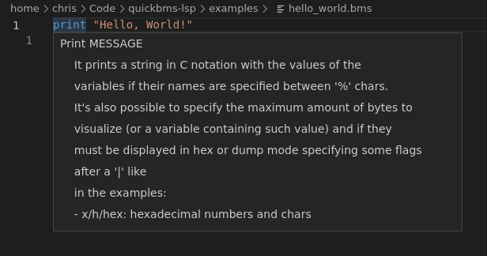
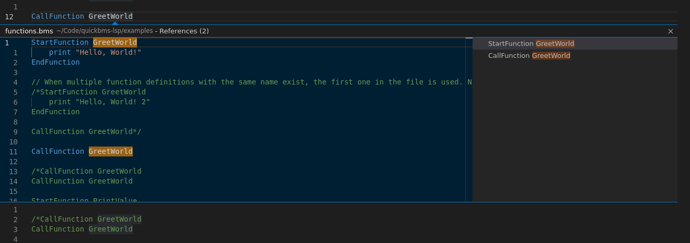

# QuickBMS-lsp 
This is an experimental language server for the scripting language QuickBMS.

## Language server endpoints
These are the currently supported language server endpoints.
* `initialize`
* `textDocument/didOpen`
* `textDocument/didChange`
* `textDocument/documentSymbol`
* `textDocument/hover`
* `textDocument/definition`
* `textDocument/references`
    * Currently only for functions

## QuickBMS commands
The following QuickBMS commands are currently supported by the langauge server.

* [ ] `QuickBMSver VERSION`
* [ ] `FindLoc VAR TYPE STRING [FILENUM] [ERR_VALUE] [END_OFF]`
* [x] `For [VAR] [OP] [VALUE] [COND] [VAR]`
    * [ ] Support all operators
* [x] `Next [VAR] [OP] [VALUE]`
* [ ] `Get VAR TYPE [FILENUM] [OFFSET]`
* [ ] `GetDString VAR LENGTH [FILENUM]`
* [x] `GoTo OFFSET [FILENUM] [TYPE]`
* [x] `IDString [FILENUM] STRING`
* [ ] `Log NAME OFFSET SIZE [FILENUM] [XSIZE]`
* [ ] `Clog NAME OFFSET ZSIZE SIZE [FILENUM] [XSIZE]`
* [ ] `Math VAR OP VAR`
* [ ] `XMath VAR INSTR`
* [ ] `Open FOLDER NAME [FILENUM] [EXISTS]`
* [ ] `SavePos VAR [FILENUM]`
* [x] `Set VAR [TYPE] VAR`
* [ ] `Do`
* [ ] `While VAR COND VAR`
* [ ] `String VAR OP VAR`
* [x] `CleanExit`
* [x] `If VAR COND VAR [...]`
    * [ ] Support all comparison operators
* [x] `[Elif VAR COND VAR]`
* [x] `[Else]`
* [x] `EndIf`
* [ ] `GetCT VAR TYPE CHAR [FILENUM]`
* [ ] `ComType ALGO [DICT] [DICT_SIZE]`
* [ ] `ReverseShort VAR [ENDIAN]`
* [ ] `ReverseLong VAR [ENDIAN]`
* [ ] `ReverseLongLong VAR [ENDIAN]`
* [x] `Endian TYPE [VAR]`
* [ ] `FileXOR SEQ [OFFSET] [FILENUM]`
* [ ] `FileRot SEQ [OFFSET] [FILENUM]`
* [ ] `FileCrypt SEQ [OFFSET] [FILENUM]`
* [ ] `Strlen VAR VAR [SIZE]`
* [ ] `GetVarChr VAR VAR OFFSET [TYPE]`
* [ ] `PutVarChr VAR OFFSET VAR [TYPE]`
* [ ] `Debug [MODE]`
* [ ] `Padding VAR [FILENUM] [BASE_OFF]`
* [ ] `Append [DIRECTION]`
* [ ] `Encryption ALGO KEY [IVEC] [MODE] [KEYLEN]`
* [x] `Print MESSAGE`
* [ ] `GetArray VAR ARRAY VAR_IDX`
* [ ] `PutArray ARRAY VAR_IDX VAR`
* [ ] `SortArray ARRAY [ALL]`
* [ ] `SearchArray VAR ARRAY VAR`
* [x] `CallFunction NAME [KEEP_VAR] [ARG1] [ARG2] ... [ARGn]`
* [x] `StartFunction NAME`
* [x] `EndFunction`
* [ ] `ScanDir PATH NAME SIZE [FILTER]`
* [ ] `CallDLL DLLNAME FUNC/OFF CONV RET [ARG1] [ARG2] ... [ARGn]`
* [ ] `Put VAR TYPE [FILENUM]`
* [ ] `PutDString VAR LENGTH [FILENUM]`
* [ ] `PutCT VAR TYPE CHAR [FILENUM]`
* [ ] `GetBits VAR BITS [FILENUM]`
* [ ] `PutBits VAR BITS [FILENUM]`
* [ ] `Include FILENAME`
* [ ] `NameCRC VAR CRC [LISTFILE] [TYPE] [POLYNOMIAL] [PARAMETERS]`
* [ ] `Codepage VAR`
* [ ] `SLog NAME OFFSET SIZE [TYPE] [FILENUM] [TAG]`
* [ ] `Reimport [MODE]`
* [ ] `Label NAME`
* [x] `Break [NAME]`
* [x] `Continue [NAME]`